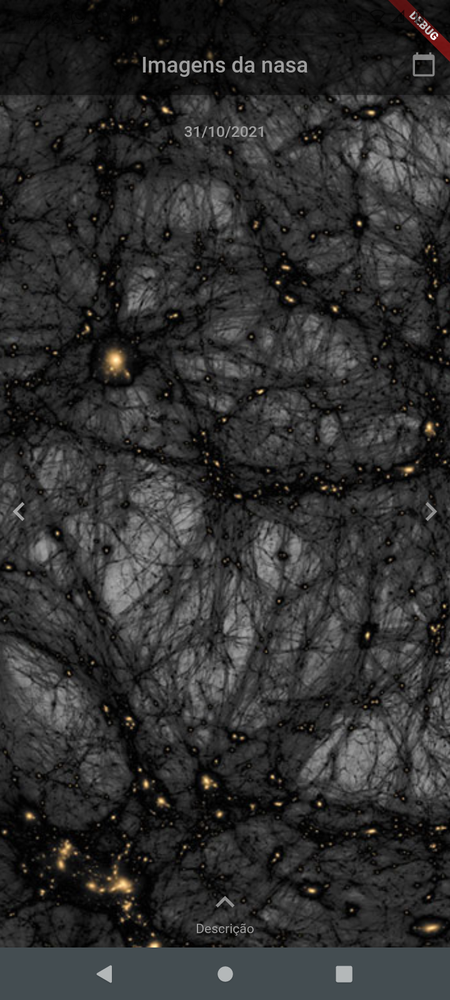
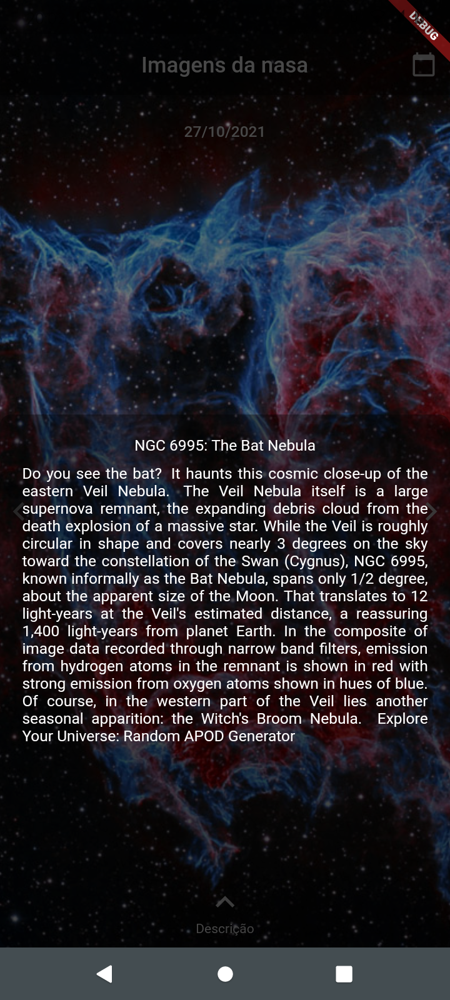

# GetPicturesOfNasaWithFlutte

A new Flutter project with clean architecture

Projeto criado para treinar 'clean architecture' acompanhando videos da [Leticia Baleiro](https://github.com/LeBaleiro), no [youtube](https://www.youtube.com/watch?v=odr59ZAx-IU)

Fiz algumas alterações como reduzir de 2 telas para 1 com mais funções(alterar data para frente e para trás sem o datepicker), ajustei um pouco a arquitetura de acordo com uma estrutura que estou mais acostumado, este projeto é uma ótima forma de praticar flutter.

